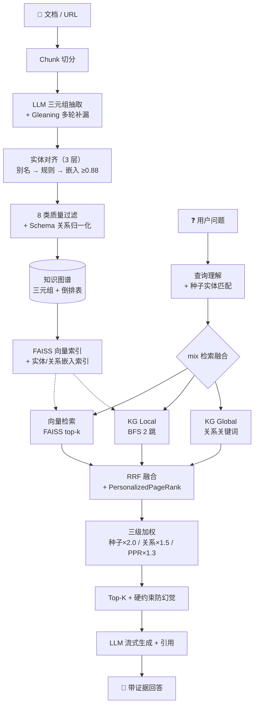
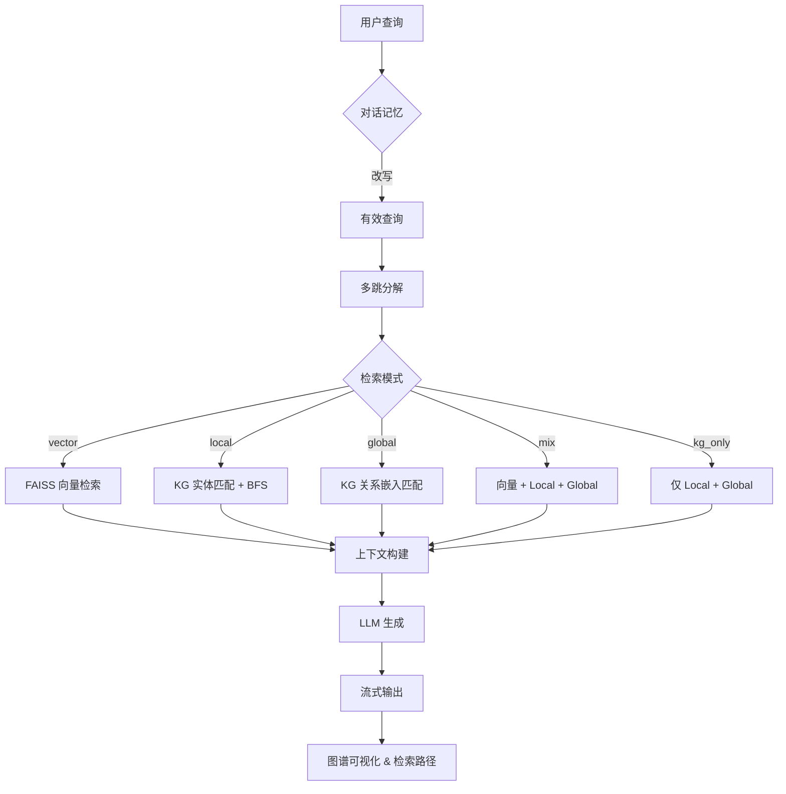

<div align="center">

# PocketGraphRAG

**本地优先的 GraphRAG，在公开 HotpotQA 上击败 LightRAG — 查询时零 LLM 调用。**<br>
上传文档 → 抽取三元组 → 构建私有图谱 → 带引用问答。无需 Neo4j，无需上云。

[](https://github.com/pocketgraphrag/PocketGraphRAG/actions/workflows/ci.yml)
[](https://codecov.io/gh/pocketgraphrag/PocketGraphRAG)
[](#quick-start)
[](https://www.python.org/downloads/)
[](./LICENSE)
[](https://docs.astral.sh/ruff/)
[](https://ollama.com/)
[](https://gradio.app/)
[](https://www.docker.com/)
[](https://pocketgraphrag.github.io/PocketGraphRAG/)

[English](./README.md) | [中文](#) | [新闻](#新闻) | [变更日志](./CHANGELOG.md) | [贡献指南](./CONTRIBUTING.md)

</div>

---

### ⚡ 30 秒安装运行

```bash
# 安装
pip install -e .                         # 源码安装（当前推荐）
# pip install "pocketgraphrag[cli]"      # 安装 `pocketgraphrag` CLI

# 运行
pocketgraphrag webui                     # Gradio Web UI，访问 http://localhost:7860
pocketgraphrag ask "你的问题"             # 单次问答，带引用
# 没装 CLI extra？ python -m PocketGraphRAG.webapp
```

<a name="hotpotqa-vs-lightrag"></a>
### 🏆 HotpotQA vs. LightRAG（公开基准，N=50，top_k=25）

在公开 **HotpotQA** distractor split 上的真实数字 — 同样的 50 个问题，
同一个 embedding 模型。任何人都可以复现。

| 框架 | Hit Rate ↑ | MRR ↑ | 查询时 LLM |
|------|:----------:|:-----:|:----------:|
| **PocketGraphRAG** | **0.86** | **0.5633** | **无**（纯 embedding + 图遍历） |
| LightRAG v1.5.4 | 0.82 | 0.2093 | 需要（关键词抽取） |
| **提升** | +0.04 | **2.7×** | 查询时零 LLM 调用 |

> 复现命令：`python bench_data/eval_merged.py`。数据集：`bench_data/hotpotqa_50.json`。

### 演进路径（消融）

每一行在前一行基础上叠加一项技术。多模型 KG 融合是突破点。

| 阶段 | 配置 | Hit Rate ↑ | MRR ↑ |
|------|------|:----------:|:------:|
| 基线 | `mix` k=5 rrf（4611 三元组） | 0.56 | 0.4207 |
| + top_k 15 | `mix` k=15 rrf | 0.72 | 0.4438 |
| + 加权融合 | `mix` k=15 weighted | 0.72 | 0.4828 |
| + Gleaning（1 轮） | `mix` k=20 weighted（7407 三元组） | 0.80 | 0.5365 |
| **+ 多模型 KG 融合** | **`mix` k=25 weighted（10559 三元组）** | **0.86** | **0.5633** |

在公开数据上 **Hit Rate 0.56 → 0.86（+54%），MRR 0.4207 → 0.5633（+34%）**。

**关键发现：**

- **多模型 KG 融合是突破点** — 融合两个 LLM 抽取的 KG（qwen-flash 7407 + qwen-max 3790 → 去重后 10559），让 Hit Rate 从 0.80 提升到 0.86。每个模型都有自己的盲区，两者的并集能找回任一模型单独漏掉的实体。这是 PocketGraphRAG 独有的能力。
- **top_k 5 → 25 是单项最大增量**（Hit +0.16）。候选越多命中越多，尤其是桥接型问题。
- **Gleaning 多轮抽取**（参考 microsoft/graphrag）找回了 5 个原本缺失实体的问题，三元组量 +60%。
- **加权融合 > RRF**：对 KG 偏置的检索，MRR +0.04，因为加权保留了 KG 精确的实体排序。
- 剩下的 7 个失败案例全部是抽取阶段实体缺失 — 这是抽取层的天花板，不是检索层的问题。

### 为什么能赢

- 🧬 **多模型 KG 融合** — 融合不同 LLM 抽取的 KG，覆盖每个模型的盲区（PocketGraphRAG 独有，Hit Rate 0.80 → 0.86）。LightRAG / nano-graphrag 只用单个模型抽 KG。
- ⚡ **零 LLM 查询** — 查询时只做纯 embedding + 图遍历，不调用 LLM。LightRAG 需要调 LLM 做关键词抽取，因此更慢，且容易受配额影响。
- 🎯 **确定性检索** — `cid` tie-breaker 保证 MRR 可复现。LightRAG / nano-graphrag 没有。

<p align="center">
  
</p>

<p align="center">
  <sub>👆 Web UI 实录 — 上传文档 → 抽取三元组 → 构建本地图谱 → 带来源问答</sub>
</p>

### ✨ 截图

| 知识图谱可视化 | 系统架构 |
|:---:|:---:|
|  |  |

| PageRank 实体重要性 | 社区发现 |
|:---:|:---:|
|  |  |

---

<a name="新闻"></a>
## 📰 新闻

- **2026-07** — `v0.3.2` 抽取与工程升级：① **Gleaning 多轮抽取**（microsoft/graphrag 风格，`GLEANING_STEPS`）；② 实体类型约束；③ 异步并发抽取；④ 存储抽象（`KVStore` ABC + `JsonKVStorage`）；⑤ 公开基准适配器（HotpotQA/MuSiQue）。476 测试通过。
- **2026-06** — `v0.3.1` schema 驱动的关系归一化：1275 → 292 种关系类型（−77%），Relation Coverage 0.18 → 0.67（+267%）。
- **2026-06** — `v0.3.0` 检索升级：PersonalizedPageRank 加权、三级打分、实体→chunk 倒排索引、文档级删除 + 孤儿级联、RAGAS 评测。rice_disease_v1：Hit 0.70→0.95，kg_only MRR 0.56→0.83。引用功能（`[1][2]` 内联 + 来源列表）。
- **2026-06** — `v0.2.1` 增量索引：新上传只编码受影响实体（对标 LightRAG 的核心护城河）。26 个单测 + 旧索引迁移。
- **2026-01** — `v0.2.0` KG 双层检索、KG 抽取 v2、VLM 多模态、PageRank、REST API，190+ 测试。
- **2025-09** — `v0.1.0` 首发：FAISS + 实体级分块 + Gradio Web UI + Ollama。
- 下一步：可插拔向量后端（Milvus/Qdrant）、Neo4j 适配、HuggingFace Space 在线 Demo。详见 [Roadmap](#路线图)。

> 📦 **安装状态**：当前以源码安装为正式支持路径。PyPI 元数据已就绪；公开发布会等 GitHub 首发闭环打磨好之后再放开。

---

## 工作原理

PocketGraphRAG 把文档变成可检索的知识图谱，分两阶段：**离线索引**（抽取 → 对齐 → 过滤 → 建索引）和**在线检索**（向量 + KG 融合 → PersonalizedPageRank 排序 → LLM 带引用生成）。



> PocketGraphRAG 帮你把上传的文档转成本地私有知识图谱，并基于可见证据和图谱关系来问答，不需要外接图数据库。

### 检索架构



## 为什么大家愿意 Star

- **一句话讲得清**：上传文档或 URL，抽取三元组，得到一个不依赖 Neo4j 的本地可检索图谱。
- **默认图谱优先**：默认 `mix` 检索展示的是 KG + 向量融合推理，不是被削弱的纯向量 demo。
- **默认本地优先**：用 FAISS + Ollama 本地跑，不必把文档发到托管服务。
- **推理看得见**：Web UI 展示检索路径、来源和图谱结构，结果可验证。
- **天生增量**：第一次构建后，新上传走增量索引，不必全量重建。

## 为什么前 3 分钟能打动人

- **无需外接图数据库就能验证价值**：在你碰 Neo4j 或基础设施之前，就能先看到图谱和带引用的答案。
- **Web UI 自带闭环**：上传、抽取、构建、切换数据集、再问、查看图谱，一个界面搞定。
- **图谱不是摆设**：检索路径、来源标签和图谱视图一起证明模型到底用了什么证据。
- **增量更新内建**：私有图谱建好后，新文件不会触发全量重建。

---

<a name="quick-start"></a>
## 快速开始

### 1. 安装

```bash
git clone https://github.com/pocketgraphrag/PocketGraphRAG.git
cd PocketGraphRAG
pip install -r requirements.txt          # 核心依赖
# pip install -e ".[all]"                # 贡献者：全量 extras（web/docs/cli/eval/dev）
```

**可选 extras：**

| Extra | 安装 | 用途 |
|-------|------|------|
| `[web]` | gradio, fastapi, uvicorn, pydantic | Gradio Web UI + REST API |
| `[docs]` | python-docx, pdfplumber, PyPDF2, beautifulsoup4, lxml, Pillow | 多格式文档导入 |
| `[playwright]` | playwright | 动态网页抓取 |
| `[cli]` | typer, uvicorn | 现代子命令 CLI（`pocketgraphrag`） |
| `[eval]` | ragas | 基于 RAGAS 的评测 |
| `[all]` | 以上全部 + dev | 完整开发环境 |

### 2. 配置 LLM（任选其一）

把 `.env.example` 复制为 `.env` 并填入一个 provider — 或者用 Ollama/freellm-cn 完全离线运行：

```bash
# 本地离线（推荐 Ollama）
ollama pull qwen2:7b
set OLLAMA_MODEL=qwen2:7b                 # Linux/Mac 用 export
set OLLAMA_API_BASE=http://localhost:11434/v1

# 本地离线（freellm-cn）
# 先启动 freellm-cn 服务：运行 start_freellm_cn.bat / start_freellm_cn.sh
set FREELM_CN_API_KEY=your-api-key        # Linux/Mac 用 export
set FREELM_CN_API_BASE=http://localhost:8000/v1
set FREELM_CN_MODEL=auto

# 云端 API（任选一个）
set DASHSCOPE_API_KEY=sk-your-key         # 阿里云，有免费额度 + VLM
# set SILICONFLOW_API_KEY=sk-your-key     # 免费 Qwen 模型
# set DEEPSEEK_API_KEY=sk-your-key
```

| Provider | 环境变量 | 备注 |
|----------|---------|------|
| **Ollama（本地）** | `OLLAMA_MODEL` | 完全离线运行，`ollama pull qwen2:7b` |
| **freellm-cn（本地）** | `FREELM_CN_API_KEY` | 本地大模型服务网关，OpenAI 兼容 |
| SiliconFlow | `SILICONFLOW_API_KEY` | 免费 Qwen 模型 |
| DashScope | `DASHSCOPE_API_KEY` | 有免费额度，支持 VLM |
| DeepSeek | `DEEPSEEK_API_KEY` | 推理能力强 |
| OpenAI 兼容 | `OPENAI_API_KEY` + `OPENAI_API_BASE` | 任意兼容 endpoint |

统一 LLM 层按优先级尝试 provider，并自动 fallback。

### 3. 启动

```bash
start_webui.bat                           # Windows（Linux/Mac 用 ./start_webui.sh）
# 手动：
python -m PocketGraphRAG.build_index      # 构建 FAISS 索引（自动下载 BGE 模型）
python -m PocketGraphRAG.webapp           # Gradio Web UI，监听 :7860
```

然后打开 **http://localhost:7860**。仓库自带一个示例数据集，无需准备数据。Docker：`docker-compose up -d`。

> 第一次体验？建议从内置的电影 KG demo 开始。即使你还没配置 LLM，Web UI 也会照常启动，方便你先验证检索、来源和图谱状态，再决定接哪种生成后端。

### 3 分钟 Demo 路径

1. 启动 Web UI → 打开 `http://localhost:7860`
2. 在示例数据上问一个内置问题
3. 在 `Data Management` 里上传文件或导入 URL
4. 点击 `开始抽取` → `构建索引并切换`
5. 回到 `问答`，在你的私有图谱上再问一次

---

## 核心特性

- **🆕 多模型 KG 融合（独有）** — 融合不同 LLM 抽取的 KG 覆盖盲区；HotpotQA Hit Rate 0.80 → 0.86。详见 [多模型 KG 融合](#多模型-kg-融合)。
- **KG 双层检索** — `local`（实体邻域）+ `global`（关系嵌入）+ `mix` 模式，LightRAG 风格。
- **增量索引** — 新上传只编码受影响实体，不必全量重建；三元组级 manifest 去重 + 旧索引迁移。详见 [增量索引](#增量索引)。
- **高质量 KG 抽取 v2** — 语义切分 → 实体对齐 → 去重 → 质量过滤；样例数据平均置信度 ≥0.94。多源导入：TXT / MD / PDF / Word / 图片（OCR+VLM）/ 网页（Playwright）。详见 [docs/data-import.md](docs/data-import.md)。
- **PageRank 增强排序** — 提升重要实体权重；内置 PageRank、社区发现（标签传播）、最短路径（BFS）。
- **实体级分块** — 按实体聚合知识，而非按字数切分，上下文更连贯。
- **实体嵌入匹配** — BGE 编码的实体向量解决实体名不一致问题（替代子串匹配）。
- **交互式图谱可视化** — ECharts 力导向图，支持搜索 + 1 跳邻域。
- **多跳查询分解** — 把复杂问题拆成子查询，覆盖更多来源。
- **引用 & 检索透明** — `[1][2]` 内联引用 + 来源列表；检索路径可见（哪些实体/关系命中、图谱如何扩展）。
- **REST API（FastAPI）** — 流式 SSE、图谱统计、实体搜索、子图接口。详见 [REST API](#rest-api)。
- **本地优先 & 隐私** — 原生 Ollama 支持；整条链路可离线运行。
- **自动 KG 抽取** — 内置 `kg_extractor.py` 从任意文本/Markdown 抽取实体和关系。
- **流式输出** — CLI 和 Web UI 都有实时打字机效果。
- **经过测试** — 216+ 单元测试，CI/CD，Ruff，类型注解。目前 **Alpha** 阶段。

### 组件与可插拔后端

PocketGraphRAG 用薄抽象层把各后端解耦，替换后端不影响 RAG 主流程。

| 层 | 默认 | 可选替代 | 备注 |
|---|------|---------|------|
| **Embedding** | `BAAI/bge-small-zh-v1.5`（FAISS） | 任意 `SentenceTransformer` | 设置 `RICE_EMBEDDING_MODEL` |
| **向量存储** | FAISS（进程内） | — | 无需外部数据库 |
| **图谱存储** | 内存 dict + JSON 落盘 | — | 通过 `KGProcessor` 插拔 |
| **LLM** | SiliconFlow / DashScope / DeepSeek / OpenAI / **Ollama** / **freellm-cn** | 任意 OpenAI 兼容 endpoint | 自动 fallback 链 |
| **VLM（多模态）** | DashScope `qwen-vl-plus` | 任意 OpenAI 兼容 VLM | OCR + 直接 KG 抽取 |
| **分块** | 实体级 | — | 按实体聚合知识 |
| **融合** | RRF（默认）/ 加权 | — | 设置 `POCKET_FUSION_STRATEGY` |
| **异步** | `acall_llm`（新增） | 保留同步 `call_llm` | 详见 [Python API](#python-api) |

---

## 特性对比

| 特性 | PocketGraphRAG | Microsoft GraphRAG | LightRAG |
|------|---------------|-------------------|----------|
| **外部数据库** | 无（纯 FAISS） | 需要 Neo4j | 无 |
| **部署难度** | 克隆即用 | 配置复杂 | CLI 服务 |
| **索引成本** | 低（单趟） | 高（社区报告） | 中 |
| **多模型 KG 融合** | **是（独有）** | 否 | 否 |
| **图谱可视化** | 交互式 ECharts | 无 | 基础 |
| **Web 数据管理** | 上传→抽取→构建 | 仅 CLI | 仅 CLI |
| **中文 Embedding** | BGE-zh-v1.5 + 中文 prompt（默认） | 英文优先（可调） | 英文优先（可调） |
| **本地 Ollama** | 原生支持 | 需配置 | 支持 |
| **增量索引** | 文档级（add/remove，无需全量重建） | 社区发现集合合并 | 集合合并（核心设计） |
| **PersonalizedPageRank** | 是（种子感知加权） | 否 | 否 |
| **引用** | 是（`[1][2]` 内联 + 来源列表） | 否 | 否 |
| **RAGAS 评测** | 内置（faithfulness/precision/recall） | 外部 | 外部 |
| **检索确定性** | 保证（cid tie-breaker） | 否 | 否 |

---

<a name="多模型-kg-融合"></a>
## 多模型 KG 融合

**PocketGraphRAG 独有** — 没有任何其他开源 GraphRAG 框架（LightRAG、nano-graphrag、Microsoft GraphRAG）支持融合多个 LLM 抽取的 KG。这是我们在公开数据上最大的检索质量杠杆。

不同 LLM 有不同的抽取盲区。更小更快的模型（如 `qwen-flash`）抽出更多三元组但噪声更大；更大的模型（如 `qwen-max`）抽出更少但更保守的三元组。两者的**并集**能找回任一模型单独漏掉的实体 — 类似抽取器集成。

| KG 来源 | 三元组 | Hit Rate | MRR |
|---------|:------:|:--------:|:---:|
| qwen-flash + gleaning(1) | 7407 | 0.80 | 0.5365 |
| qwen-max + gleaning(2) | 3790 | 0.66 | 0.4127 |
| **融合（并集，去重）** | **10559** | **0.86** | **0.5633** |

融合让 Hit Rate **+0.06**、MRR **+0.027**，超过最好的单模型 KG — 仅仅是把抽取跑两遍、用不同模型、再合并，就白捡了一波提升。

```python
from PocketGraphRAG.kg_extractor import extract_knowledge_graph

# 用模型 A 抽取
result_a = extract_knowledge_graph(text, model="qwen-flash", gleaning_steps=1)
# 用模型 B 抽取
result_b = extract_knowledge_graph(text, model="qwen-max", gleaning_steps=2)

# 融合：三元组并集，自动去重
merged = {(t.head, t.relation, t.tail) for t in result_a.triples}
merged |= {(t.head, t.relation, t.tail) for t in result_b.triples}
# 用融合后的 KG 建索引
```

> `bench_data/merge_kg.py` 脚本可复现 HotpotQA 融合结果。完整消融：[docs/evaluation.md](docs/evaluation.md)。

---

<a name="增量索引"></a>
## 增量索引

> v0.2.1 — 对标 LightRAG 的核心护城河：第一次构建后，上传新文档只重新编码受影响实体，而不是重建全部三个 FAISS 索引。这正是把"多格式上传 → KG"从 demo 变成可生产的关键。

### 为什么要增量？

旧行为：每次上传都触发主 FAISS 索引、实体嵌入索引、关系嵌入索引的全量重建。成本随累计语料线性增长，几百个三元组之后频繁上传就不可用了。

新行为：只有获得新三元组的实体（以及全新实体）才重新编码。相同三元组通过持久化 manifest 哈希集合跳过。成本与**增量**成正比，而与语料规模无关。

### 三级增量策略

| 索引 | 策略 |
|------|------|
| 主向量索引（`FAISSIndex`） | 新实体 → `add_chunks`；受影响实体 → `remove_by_entity` + `add_chunks`（从 embeddings 缓存重建，**移除步骤零模型调用**） |
| 实体嵌入索引（`entity_faiss.index`） | 纯追加（实体名不可变） |
| 关系嵌入索引（`relation_faiss.index`） | 纯追加（关系名不可变） |

移除步骤用内存里的 `embeddings.npy` 缓存 + numpy 切片 + `IndexFlatIP` 重建 — O(n) 内存操作，无需重新编码。这是相对 `IndexIDMap2` 的有意取舍：更简单、活动部件更少，缓存还能兼作向后兼容的迁移源。

### 基于 manifest 的三元组级去重

`triples_manifest.json` 持久化一个已入索引的 `head|relation|tail` 键的有序 JSON 数组。每次增量调用：

1. 加载 manifest（首次运行 / 旧索引迁移时从 `data_path` 重建）。
2. 跳过键已在集合中的三元组 — 对全重复批次**零计算**。
3. 把新键加入集合并持久化。

### 向后兼容

v0.2.1 之前构建的旧索引在首次增量调用时自动迁移（缺失 `embeddings.npy` → 用 `reconstruct_n` 重建；缺失 `triples_manifest.json` → 从 `data_path` 重建）。用户无需任何操作。

### Python API & CLI

```python
from PocketGraphRAG.incremental_index import add_triples_incremental, reset_index

stats = add_triples_incremental(
    new_triples=[("实体A", "关系", "实体B")],
    model=model, index_dir=INDEX_DIR, data_path=DATA_PATH,
)
# stats = {"new_triples": 1, "skipped_duplicates": 0, "new_entities": 2, ...}
reset_index(model, index_dir=INDEX_DIR, data_path=DATA_PATH)   # 全量重建
```

```bash
python -m PocketGraphRAG.build_index add --triples new_triples.txt   # 增量
python -m PocketGraphRAG.build_index reset                            # 全量重建
```

---

## 检索模式

| 模式 | 说明 | 适用场景 |
|------|------|----------|
| `vector` | 纯向量相似度检索 | 通用查询 |
| `local` | 实体嵌入匹配 + BFS 邻域扩展 | 实体相关查询 |
| `global` | 关系嵌入匹配 + 实体收集 | 关系相关查询 |
| `mix` | 向量 + Local + Global 融合（默认） | 综合效果最佳 |
| `kg_only` | 纯 KG（Local + Global，不走向量） | KG 基线 / 垂直领域 KG-RAG |

对垂直领域 KG，`kg_only` 通常给出最高 MRR，因为实体级 KG 排序已经足够精确，向量噪声反而会拖累排名。详见 [docs/search-modes.md](docs/search-modes.md)。

## 配置项

| 环境变量 | 说明 | 默认值 |
|---------|------|--------|
| `POCKET_DATA_PATH` | 三元组数据文件路径 | 示例数据 |
| `POCKET_SEARCH_MODE` | 默认检索模式 | `mix` |
| `POCKET_REVERSE_LINK_RELATIONS` | 反向链接关系（逗号分隔） | 自动检测 |
| `POCKET_AUTO_REVERSE_LINK` | 自动检测反向链接关系 | `true` |
| `ENTITY_SIMILARITY_THRESHOLD` | 实体匹配阈值 | `0.5` |
| `KG_SEARCH_HOPS` | BFS 扩展跳数 | `2` |
| `TOP_K` | 检索返回数量 | `5` |

---

## 多源数据导入

PocketGraphRAG 从多种来源导入知识、抽取三元组、构建 KG。抽取器 v2 用 5 阶段流水线：语义切分 → LLM 抽取 → 实体对齐 → 去重 → 质量过滤。

| 来源 | 格式 | 依赖 | 质量 |
|------|------|------|------|
| **纯文本** | `.txt` / `.md` | - | ⭐⭐⭐⭐⭐ |
| **PDF（文字）** | `.pdf` | `pip install pdfplumber` | ⭐⭐⭐⭐ |
| **PDF（扫描）** | `.pdf` | `pdfplumber pdf2image` + VLM | ⭐⭐⭐⭐ |
| **Word** | `.doc` / `.docx` | `pip install python-docx` | ⭐⭐⭐⭐ |
| **图片** | `.jpg` / `.png` / `.webp` | VLM 模型（推荐 DashScope Qwen-VL） | ⭐⭐⭐⭐ |
| **网页** | URL | `requests beautifulsoup4` | ⭐⭐⭐⭐ |
| **动态网页** | URL（JS 重） | `playwright && playwright install chromium` | ⭐⭐⭐⭐ |

各来源抽取示例和完整质量矩阵：[docs/data-import.md](docs/data-import.md)。

---

## 构建你自己的知识图谱

**通过 Web UI**："Data Management" tab → 上传 → 抽取 → 建索引，一键完成。后续上传走增量索引。

**通过 CLI：**
```bash
# 第 1 步：自动抽取三元组
python -m PocketGraphRAG.kg_extractor --input your_document.txt --output my_triples.txt

# 第 2 步：设置路径并重建
set POCKET_DATA_PATH="my_triples.txt"
python -m PocketGraphRAG.build_index
python -m PocketGraphRAG.webapp
```

---

## 评测

PocketGraphRAG 自带基准 + RAGAS 评测 harness（灵感来自 MultiHop-RAG / LightRAG `reproduce/`）。在公开 **HotpotQA** split（N=50）上，完整 pipeline 达到 **Hit Rate 0.86 / MRR 0.5633**。

```bash
python -m PocketGraphRAG.eval_harness --search-mode mix --top-k 5 --no-generation   # 仅检索
python -m PocketGraphRAG.eval_harness --ragas --ollama-model qwen2.5:7b             # + RAGAS（本地评测器）
```

检索指标（`hit_rate`、`mrr`、`entity_coverage`、`relation_coverage`）不需要 LLM；RAGAS（`faithfulness`、`answer_relevancy`、`context_precision`、`context_recall`）复用 `call_llm` 层，因此可以用本地 Ollama 模型当评测器 — 无需 OpenAI key。

- 公开 HotpotQA 消融 & vs-LightRAG：见[首屏表格](#hotpotqa-vs-lightrag) 和 [docs/evaluation.md](docs/evaluation.md)。
- 领域基准（rice_disease_v1，N=20）：见 [examples/rice/rice_disease_benchmark.md](examples/rice/rice_disease_benchmark.md)。

---

<a name="python-api"></a>
## Python API

```python
from PocketGraphRAG import PocketGraphRAG

# 初始化
rag = PocketGraphRAG(
    search_mode="mix",
    use_multihop=True,
    use_conversation=True,
    use_pagerank=True,
)

# 提问
result = rag.answer("盗梦空间是谁导演的？")
print(result["answer"])
print(f"来源数: {len(result['sources'])}")
print(f"命中 KG 实体: {result['pipeline_info']['kg_entities_matched']}")

# 流式模式
for chunk in rag.answer_stream("诺兰拍过哪些电影？"):
    if "chunk" in chunk:
        print(chunk["chunk"], end="", flush=True)
```

更多：[docs/python-api.md](docs/python-api.md) · [docs/cli.md](docs/cli.md)。

---

<a name="rest-api"></a>
## REST API

PocketGraphRAG 自带基于 FastAPI 的 REST API 服务器，方便程序化接入。

```bash
python -m PocketGraphRAG.api_server --host 0.0.0.0 --port 8000
# 交互式 Swagger UI：http://localhost:8000/docs
```

| 方法 | 接口 | 说明 |
|------|------|------|
| POST | `/api/qa` | 非流式问答 |
| POST | `/api/qa/stream` | 流式问答（SSE） |
| GET | `/api/graph/stats` | 图谱统计（实体、关系、三元组） |
| GET | `/api/graph/entities` | 列出所有实体 |
| GET | `/api/graph/relations` | 列出所有关系 |
| GET | `/api/graph/entities/search?q=...` | 按名称搜索实体 |
| GET | `/api/graph/entity/{name}/detail` | 实体详情（含邻居） |
| GET | `/api/graph/entity/{name}/subgraph` | 实体邻域子图 |
| POST | `/api/graph/subgraph` | 多种子实体的子图 |
| GET | `/api/graph/pagerank` | 按 PageRank 重要性排序的实体 |
| GET | `/api/graph/communities` | 社区发现结果 |
| GET | `/api/graph/path?start=&end=` | 两实体间最短路径 |
| GET | `/health` | 健康检查 |

完整文档：[docs/rest-api.md](docs/rest-api.md)。

---

## Web UI 功能

### 1. 问答 Tab
- 流式响应的交互式聊天
- 实时检索路径展示（看到哪些实体/关系被命中）
- 带相似度分数的来源引用
- 多跳与检索模式切换
- 对话记忆

### 2. 数据管理 Tab
- 上传 **TXT / Markdown / PDF / Word (.docx) / 图片** 文档
- 从 **网页 URL** 导入（静态或 Playwright 动态渲染）
- 一键 LLM 三元组抽取，带质量统计
- 构建知识图谱索引
- 在示例数据集与用户数据集间切换
- 图片模式：OCR 文本抽取，或通过 VLM 直接 KG 抽取

### 3. 知识图谱 Tab
- ECharts 交互式力导向图
- 搜索实体并查看其 1 跳邻域
- 节点大小反映连接度
- 悬停看详情，拖拽重新布局

---

## 项目结构

```text
PocketGraphRAG/
├── PocketGraphRAG/           # 核心框架
│   ├── __init__.py           # 公共 API
│   ├── config.py             # 全局配置
│   ├── llm.py                # 统一 LLM 层（流式、多 provider）
│   ├── kg_extractor.py       # 自动 KG 抽取
│   ├── kg_reasoning.py       # KG 双层检索器 + 图谱导出
│   ├── data_processor.py     # 实体级分块
│   ├── build_index.py        # FAISS + 实体 + 关系索引构建（CLI: build/add/reset）
│   ├── incremental_index.py  # 增量索引（add/remove，无需全量重建）
│   ├── rag_system.py         # RAG 核心引擎
│   ├── conversation.py       # 对话记忆
│   ├── multihop.py           # 多跳查询分解
│   ├── evaluate.py           # 消融实验
│   ├── eval_harness.py       # 基准 + RAGAS 评测 harness
│   ├── app.py                # CLI 入口
│   ├── webapp.py             # Gradio Web UI（问答 + 数据管理 + 图谱可视化）
│   ├── cli.py                # 现代 Typer CLI（`pocketgraphrag`）
│   └── tests/                # 单元测试
├── examples/                 # 示例数据集（movie_kg / rice / cat_encyclopedia）
├── docs/                     # 扩展文档
├── bench_data/               # HotpotQA 基准脚本与数据
├── pyproject.toml            # PyPI 包配置
├── Dockerfile                # Docker 镜像
├── docker-compose.yml        # Docker Compose
├── ruff.toml                 # 代码风格配置
├── .pre-commit-config.yaml   # Pre-commit hooks
├── requirements.txt          # 依赖
└── README.md
```

---

## 常见问题

**Q：需要 GPU 吗？**
A：不需要。BGE embedding 模型在 CPU 上跑得很好。LLM 生成用 Ollama + 小模型（如 `qwen2:7b`）在多数现代 CPU 上都能跑。

**Q：和 LightRAG 有什么区别？**
A：零 LLM 查询（LightRAG 需要 LLM 做关键词抽取）、多模型 KG 融合（独有）、确定性检索（cid tie-breaker）、实体级分块、交互式图谱可视化、Web 化数据管理。详见 [HotpotQA 对比表](#hotpotqa-vs-lightrag)。

**Q：能用于生产吗？**
A：目前是 Alpha。核心链路稳定（216+ 测试），但生产前建议在你自己的数据上充分测试。

**Q：怎么加自己的数据？**
A：用 Web UI 的 "Data Management" tab，或 CLI 工具 `kg_extractor.py`。

**Q：`pocketgraphrag` 命令找不到？**
A：现代 Typer CLI 需要安装 `[cli]` extra：`pip install "pocketgraphrag[cli]"`。或用始终可用的旧入口：`python -m PocketGraphRAG.app`。

> 更多 FAQ：[docs/faq.md](docs/faq.md)。

---

<a name="路线图"></a>
## Roadmap

- [x] KG 双层检索（`local` / `global` / `mix` / `kg_only`）+ RRF 融合
- [x] KG 抽取 v2（语义切分 → 对齐 → 去重 → 质量过滤）
- [x] 多源导入（TXT / MD / PDF / Word / Image / Web）
- [x] REST API 服务器 + 流式 SSE
- [x] 异步 LLM 入口（`acall_llm`）+ 流式
- [x] **增量索引**（文档级 add/remove、manifest 去重、旧索引迁移）
- [x] **评测 harness**：MultiHop-style benchmark + RAGAS 集成（4 指标，Ollama 评测器）
- [ ] **可插拔向量后端**：Milvus / Qdrant 适配
- [ ] **可插拔图谱存储**：面向大规模 KG 的 Neo4j 适配
- [ ] **Hugging Face Space** 一键在线 demo
- [ ] **Langfuse / OpenTelemetry** 追踪集成
- [ ] **Re-ranking**：cross-encoder reranker 阶段

进度详见 [open issues](https://github.com/pocketgraphrag/PocketGraphRAG/issues) 和 [CHANGELOG.md](./CHANGELOG.md)。

---

## 贡献

欢迎贡献！你可以这样参与：

1. **报告 Bug**：开 issue，附详细描述和复现步骤。
2. **提特性需求**：开 issue 讨论你的想法。
3. **提交 PR**：fork 仓库、建分支、提 pull request。

### 开发环境

```bash
# 安装开发依赖
pip install -e ".[dev]"

# 安装 pre-commit hooks
pre-commit install

# 跑测试
pytest

# 跑 linter
ruff check .
ruff format .
```

详见 [CONTRIBUTING.md](./CONTRIBUTING.md)。

---

## 引用

如果你在研究或项目中用了 PocketGraphRAG，请引用：

```bibtex
@misc{pocketgraphrag,
  title  = {PocketGraphRAG: A Lightweight, Local-First GraphRAG Framework for Vertical Domains},
  author = {PocketGraphRAG Team},
  year   = {2026},
  url    = {https://github.com/pocketgraphrag/PocketGraphRAG},
  note   = {Version 0.3.2, Alpha}
}
```

## 许可证

MIT License — 详见 [LICENSE](./LICENSE)。

---

## 文档

- [入门](docs/getting-started.md) · [快速开始](docs/quickstart.md) · [CLI](docs/cli.md)
- [架构](docs/architecture.md) · [检索模式](docs/search-modes.md)
- [Python API](docs/python-api.md) · [REST API](docs/rest-api.md)
- [评测 harness](docs/evaluation.md) · [数据导入](docs/data-import.md) · [FAQ](docs/faq.md)
- [领域基准（rice_disease）](examples/rice/rice_disease_benchmark.md)
- [English](./README.md)
