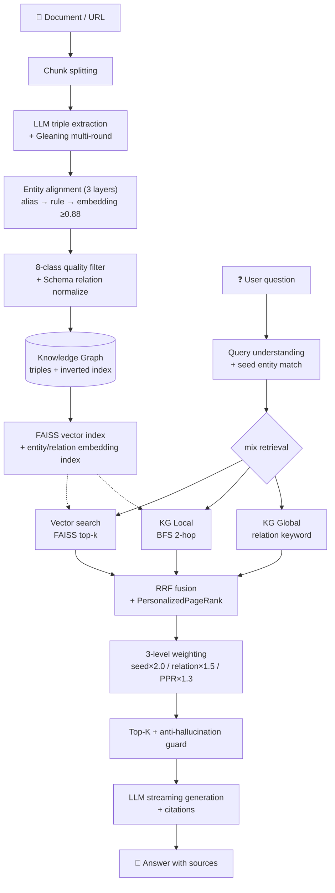
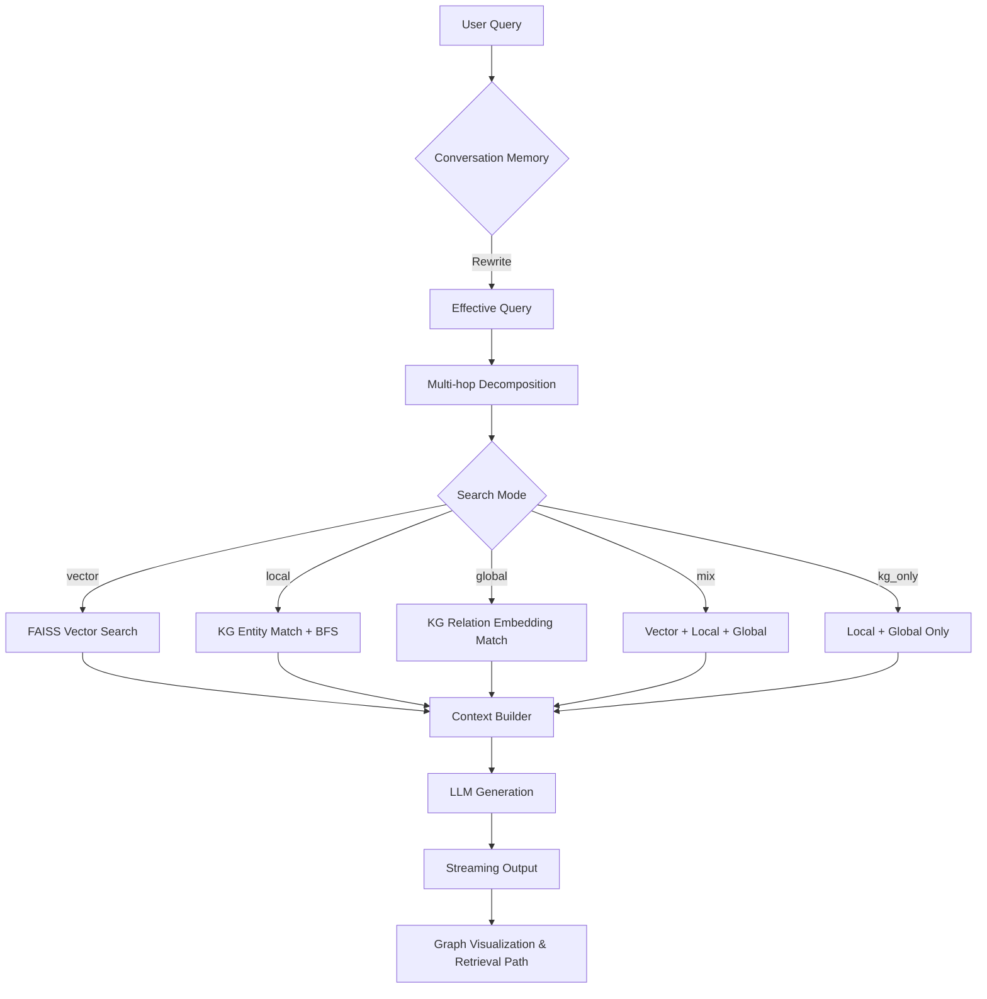

<div align="center">

# PocketGraphRAG

**A local-first GraphRAG that beats LightRAG on public HotpotQA — zero LLM calls at query time.**<br>
Upload docs → extract triples → build a private graph → ask with citations. No Neo4j, no cloud required.

[](https://github.com/jyzisliubi/Pocket-graph/actions/workflows/ci.yml)
[](https://codecov.io/gh/jyzisliubi/Pocket-graph)
[](#quick-start)
[](https://www.python.org/downloads/)
[](./LICENSE)
[](https://docs.astral.sh/ruff/)
[](https://ollama.com/)
[](https://gradio.app/)
[](https://www.docker.com/)
[](https://pocketgraphrag.github.io/PocketGraphRAG/)

[English](#) | [中文](./README-zh.md) | [News](#news) | [Change Log](./CHANGELOG.md) | [Contributing](./CONTRIBUTING.md)

</div>

---

### ⚡ Install & Run in 30 Seconds

```bash
# Install
pip install -e .                         # from source (recommended today)
# pip install "pocketgraphrag[cli]"      # adds the `pocketgraphrag` CLI

# Run
pocketgraphrag webui                     # React Web UI on http://localhost:8000
pocketgraphrag ask "你的问题"             # one-shot Q&A with citations
# No CLI extra? python -m PocketGraphRAG.webapp
```

<a name="hotpotqa-vs-lightrag"></a>
### 🏆 HotpotQA vs. LightRAG (public benchmark, N=50, top_k=25)

Real numbers on the public **HotpotQA** distractor split — same 50 questions,
same embedding model. Reproducible by anyone.

| Framework | Hit Rate ↑ | MRR ↑ | Query-time LLM |
|-----------|:----------:|:-----:|:--------------:|
| **PocketGraphRAG** | **0.86** | **0.5633** | **None** (pure embedding + graph traversal) |
| LightRAG v1.5.4 | 0.82 | 0.2093 | Required (keyword extraction) |
| **Improvement** | +0.04 | **2.7×** | Zero LLM calls at query time |

> Reproduce with `python bench_data/eval_merged.py`. Dataset: `bench_data/hotpotqa_50.json`.

### How We Got There (ablation)

Each row adds one technique on top of the previous. Multi-Model KG Fusion is the breakthrough step.

| Stage | Config | Hit Rate ↑ | MRR ↑ |
|-------|--------|:----------:|:------:|
| Baseline | `mix` k=5 rrf (4611 triples) | 0.56 | 0.4207 |
| + top_k 15 | `mix` k=15 rrf | 0.72 | 0.4438 |
| + weighted fusion | `mix` k=15 weighted | 0.72 | 0.4828 |
| + Gleaning (1 round) | `mix` k=20 weighted (7407 triples) | 0.80 | 0.5365 |
| **+ Multi-Model KG Fusion** | **`mix` k=25 weighted (10559 triples)** | **0.86** | **0.5633** |

**Hit Rate 0.56 → 0.86 (+54%), MRR 0.4207 → 0.5633 (+34%)** on public data.

**Key findings:**

- **Multi-Model KG Fusion is the breakthrough** — combining KGs from two LLMs (qwen-flash 7407 + qwen-max 3790 → 10559 deduped) lifted Hit Rate 0.80 → 0.86. Each model has blind spots; their union recovers entities either model alone misses. Unique to PocketGraphRAG.
- **top_k 5 → 25 is the largest single factor** (Hit +0.16). More candidates = more hits, especially for bridge questions.
- **Gleaning multi-round extraction** (microsoft/graphrag-inspired) recovers 5 missing-entity questions, +60% triples.
- **Weighted fusion > RRF** for KG-biased retrieval (MRR +0.04), because weighted preserves KG's precise entity ranking.
- The 7 remaining failures are all entity-missing at extraction time — an extraction-layer ceiling, not a retrieval-layer problem.

### Why It Wins

- 🧬 **Multi-Model KG Fusion** — Merge KGs from different LLMs to cover each model's blind spots (unique to PocketGraphRAG, lifted Hit Rate 0.80 → 0.86). LightRAG / nano-graphrag extract KG with a single model only.
- ⚡ **Zero-LLM Query** — Pure embedding + graph traversal at query time, no LLM calls. LightRAG needs an LLM for keyword extraction, so it is slower and vulnerable to quota exhaustion.
- 🎯 **Deterministic Retrieval** — A `cid` tie-breaker guarantees reproducible MRR. LightRAG / nano-graphrag do not.

<p align="center">
  
</p>

<p align="center">
  <sub>👆 Live Web UI capture — Upload a document → extract triples → build a local graph → ask with sources</sub>
</p>

### ✨ Screenshots

| Knowledge Graph Visualization | System Architecture |
|:---:|:---:|
|  |  |

| Pagerank Entity Importance | Community Detection |
|:---:|:---:|
|  |  |

---

<a name="news"></a>
## 📰 News

- **2026-07** — `v0.3.2` extraction & engineering upgrade: ① **Gleaning multi-round extraction** (microsoft/graphrag-style, `GLEANING_STEPS`); ② entity-type constraints (25 rice-domain types); ③ async concurrent extraction; ④ storage abstraction (`KVStore` ABC + `JsonKVStorage`); ⑤ public benchmark adapters (HotpotQA/MuSiQue). 476 passed.
- **2026-06** — `v0.3.1` schema-driven relation normalization: 1275 → 292 relation types (−77%), Relation Coverage 0.18 → 0.67 (+267%).
- **2026-06** — `v0.3.0` retrieval upgrade: PersonalizedPageRank weighting, 3-level scoring, entity→chunk inverted index, document-level delete + orphan cascade, RAGAS eval. rice_disease_v1: Hit 0.70→0.95, kg_only MRR 0.56→0.83. Citation feature ([1][2] inline + sources).
- **2026-06** — `v0.2.1` incremental indexing: new uploads only encode affected entities (LightRAG-style core moat). 26 unit tests + legacy index migration.
- **2026-01** — `v0.2.0` KG dual-layer retrieval, KG extraction v2, VLM multimodal, PageRank, REST API, 190+ tests.
- **2025-09** — `v0.1.0` first release: FAISS + entity-level chunking + Gradio Web UI + Ollama.
- Next: pluggable vector backends (Milvus/Qdrant), Neo4j adapter, HuggingFace Space demo. See [Roadmap](#roadmap).

> 📦 **Install status**: source install is the supported path today. PyPI metadata is ready; the public package release is intentionally deferred until the GitHub launch path is fully tightened.

---

## How It Works

PocketGraphRAG turns documents into a searchable knowledge graph in two phases: **offline indexing** (extract → align → filter → index) and **online retrieval** (vector + KG mix → PersonalizedPageRank ranking → LLM generation with citations).



> PocketGraphRAG helps you upload documents, turn them into a private local knowledge graph, and ask questions with visible evidence and graph-aware retrieval, without wiring up an external graph database.

### Retrieval Architecture



## Why People Star It

- **One clear story**: upload docs or URLs, extract triples, get a searchable local graph without Neo4j.
- **Graph first by default**: the default `mix` retrieval shows KG + vector reasoning, not a weakened vector-only demo.
- **Private by default**: run locally with FAISS + Ollama instead of shipping docs to a hosted stack.
- **Visible reasoning**: the Web UI shows retrieval path, sources, and graph structure so results feel inspectable.
- **Incremental by design**: after the first build, new uploads go through incremental indexing, not full rebuilds.

## Why It Wins The First 3 Minutes

- **No external graph DB to prove value**: get to a visible graph and citation-backed answer before touching Neo4j or infra.
- **Web UI does the whole loop**: upload, extract, build, switch dataset, ask again, inspect graph.
- **The graph is not decorative**: retrieval path, source labels, and graph view help users verify what the model is using.
- **Incremental updates are built in**: once your private graph exists, new files do not force a full rebuild.

---

<a name="quick-start"></a>
## Quick Start

### 1. Install

```bash
git clone https://github.com/jyzisliubi/Pocket-graph.git
cd PocketGraphRAG
pip install -r requirements.txt          # core
# pip install -e ".[all]"                # contributors: full extras (web/docs/cli/eval/dev)
```

**Optional extras:**

| Extra | Installs | Use |
|-------|----------|-----|
| `[web]` | fastapi, uvicorn, pydantic, React 18 (built-in) | React Web UI + REST API |
| `[docs]` | python-docx, pdfplumber, PyPDF2, beautifulsoup4, lxml, Pillow | Multi-format document import |
| `[playwright]` | playwright | Dynamic web page scraping |
| `[cli]` | typer, uvicorn | Modern subcommand CLI (`pocketgraphrag`) |
| `[eval]` | ragas | RAGAS-based evaluation |
| `[all]` | all of the above + dev | Full development environment |

### 2. Configure an LLM (choose one)

Copy `.env.example` to `.env` and fill in one provider — or run fully offline with Ollama:

```bash
# Local offline (recommended)
ollama pull qwen2:7b
set OLLAMA_MODEL=qwen2:7b                 # export on Linux/Mac
set OLLAMA_API_BASE=http://localhost:11434/v1

# Cloud API (pick one)
set DASHSCOPE_API_KEY=sk-your-key         # Alibaba, free tier + VLM
# set SILICONFLOW_API_KEY=sk-your-key     # free Qwen models
# set DEEPSEEK_API_KEY=sk-your-key
```

| Provider | Env var | Notes |
|----------|---------|-------|
| **Ollama (local)** | `OLLAMA_MODEL` | Run fully offline. `ollama pull qwen2:7b` |
| SiliconFlow | `SILICONFLOW_API_KEY` | Free Qwen models |
| DashScope | `DASHSCOPE_API_KEY` | Free tier, supports VLM |
| DeepSeek | `DEEPSEEK_API_KEY` | Strong reasoning |
| OpenAI-compatible | `OPENAI_API_KEY` + `OPENAI_API_BASE` | Any compatible endpoint |

The unified LLM layer tries providers in priority order and auto-falls-back.

### 3. Launch

```bash
start_webui.bat                           # Windows (or ./start_webui.sh on Linux/Mac)
# Manual:
python -m PocketGraphRAG.build_index      # build FAISS index (auto-downloads BGE model)
python -m PocketGraphRAG.api_server       # React Web UI on :8000 (or webapp.py for legacy Gradio on :7860)
```

Then open **http://localhost:7860**. The repo ships with a rice-disease demo dataset, so no data prep is needed. Docker: `docker-compose up -d`.

> New here? Start with the bundled movie KG demo. The Web UI starts even without an LLM configured, so you can verify retrieval, sources, and graph state before wiring up generation.

### 3-Minute Demo Path

1. Start the Web UI → open `http://localhost:7860`
2. Ask one built-in question on the demo dataset
3. In `Data Management`, upload a file or import a URL
4. Click `开始抽取` → `构建索引并切换`
5. Go back to `问答` and ask again on your private graph

---

## Key Features

- **🆕 Multi-Model KG Fusion (unique)** — Merge KGs from different LLMs to cover blind spots; lifted HotpotQA Hit Rate 0.80 → 0.86. See [Multi-Model KG Fusion](#multi-model-kg-fusion).
- **KG Dual-Layer Retrieval** — `local` (entity neighborhood) + `global` (relation embedding) + `mix` mode, LightRAG-style.
- **Incremental Indexing** — New uploads only encode affected entities, not a full rebuild; triple-level manifest dedup + legacy migration. See [Incremental Indexing](#incremental-indexing).
- **High-Quality KG Extraction v2** — Semantic chunking → entity alignment → dedup → quality filter; avg confidence ≥0.94 on sample data. Multi-source import: TXT / MD / PDF / Word / Images (OCR+VLM) / Web (Playwright). Details in [docs/data-import.md](docs/data-import.md).
- **PageRank-Enhanced Ranking** — Boosts important entities; built-in PageRank, community detection (label propagation), shortest path (BFS).
- **Entity-Level Chunking** — Groups knowledge by entity, not token count, for coherent context.
- **Entity Embedding Matching** — BGE-encoded entity vectors solve entity-name inconsistency (replaces substring matching).
- **Interactive Graph Visualization** — Force-directed ECharts graph with search + 1-hop neighborhood.
- **Multi-hop Query Decomposition** — Breaks complex questions into sub-queries for broader source coverage.
- **Citation & Retrieval Transparency** — `[1][2]` inline citations + sources list; visible retrieval path (which entities/relations matched, how the graph expanded).
- **REST API (FastAPI)** — Streaming SSE, graph stats, entity search, subgraph endpoints. See [REST API](#rest-api).
- **Local-First & Privacy** — Native Ollama support; run the entire pipeline offline.
- **Auto KG Extraction** — Built-in `kg_extractor.py` extracts entities/relations from any text/Markdown.
- **Streaming Output** — Real-time typewriter effect for both CLI and Web UI.
- **Tested** — 216+ unit tests, CI/CD, Ruff, type hints. Currently **alpha**.

### Components & Pluggable Backends

PocketGraphRAG uses thin abstraction layers so each backend can be swapped without touching the RAG pipeline.

| Layer | Default | Supported alternatives | Notes |
|-------|---------|-------------------------|-------|
| **Embedding** | `BAAI/bge-small-zh-v1.5` (FAISS) | any `SentenceTransformer` | set `RICE_EMBEDDING_MODEL` |
| **Vector Store** | FAISS (in-process) | — | no external DB required |
| **Graph Storage** | in-memory dict + JSON dump | — | pluggable via `KGProcessor` |
| **LLM** | SiliconFlow / DashScope / DeepSeek / OpenAI / **Ollama** | any OpenAI-compatible endpoint | auto-fallback chain |
| **VLM (multimodal)** | DashScope `qwen-vl-plus` | any OpenAI-compatible VLM | OCR + direct KG extraction |
| **Chunking** | Entity-level | — | groups knowledge by entity |
| **Fusion** | RRF (default) / weighted | — | set `POCKET_FUSION_STRATEGY` |
| **Async** | `acall_llm` (added) | sync `call_llm` kept | see [Python API](#python-api) |

---

## Feature Comparison

| Feature | PocketGraphRAG | Microsoft GraphRAG | LightRAG |
|---------|---------------|-------------------|----------|
| **External DB** | None (FAISS only) | Requires Neo4j | None |
| **Setup** | Clone & run | Complex configuration | CLI server |
| **Indexing Cost** | Low (single-pass) | High (community reports) | Medium |
| **Multi-Model KG Fusion** | **Yes (unique)** | No | No |
| **KG Visualization** | Interactive ECharts | No | Basic |
| **Web Data Mgmt** | Upload → Extract → Build | CLI only | CLI only |
| **Chinese Embedding** | BGE-zh-v1.5 + Chinese prompts (default) | English-first (tunable) | English-first (tunable) |
| **Local Ollama** | Native support | Requires setup | Supported |
| **Incremental Indexing** | Document-level (add/remove, no full rebuild) | Community-detect set merge | Set merge (core design) |
| **PersonalizedPageRank** | Yes (seed-aware weighting) | No | No |
| **Citation** | Yes ([1][2] inline + sources list) | No | No |
| **RAGAS Eval** | Built-in (faithfulness/precision/recall) | External | External |
| **Retrieval Determinism** | Guaranteed (cid tie-breaker) | No | No |

---

## Multi-Model KG Fusion

**Unique to PocketGraphRAG** — no other open-source GraphRAG framework (LightRAG, nano-graphrag, Microsoft GraphRAG) supports merging KGs extracted by multiple LLMs. This is our biggest retrieval-quality lever on public data.

Different LLMs have different extraction blind spots. A smaller/faster model (e.g. `qwen-flash`) extracts more triples with more noise; a larger model (e.g. `qwen-max`) extracts fewer but more conservative triples. Their **union** recovers entities that either model alone misses — like an ensemble of extractors.

| KG Source | Triples | Hit Rate | MRR |
|-----------|:-------:|:--------:|:---:|
| qwen-flash + gleaning(1) | 7407 | 0.80 | 0.5365 |
| qwen-max + gleaning(2) | 3790 | 0.66 | 0.4127 |
| **Fused (union, deduped)** | **10559** | **0.86** | **0.5633** |

Fusion lifted Hit Rate **+0.06** and MRR **+0.027** over the best single-model KG — a free win from running extraction twice with different models and merging.

```python
from PocketGraphRAG.kg_extractor import extract_knowledge_graph

# Extract with model A
result_a = extract_knowledge_graph(text, model="qwen-flash", gleaning_steps=1)
# Extract with model B
result_b = extract_knowledge_graph(text, model="qwen-max", gleaning_steps=2)

# Fuse: union of triples, automatic dedup
merged = {(t.head, t.relation, t.tail) for t in result_a.triples}
merged |= {(t.head, t.relation, t.tail) for t in result_b.triples}
# Build index from the fused KG
```

> The `bench_data/merge_kg.py` script reproduces the HotpotQA fusion result. Full ablation: [docs/evaluation.md](docs/evaluation.md).

---

## Incremental Indexing

> v0.2.1 — matches LightRAG's core moat: after the first build, uploading new documents only re-encodes affected entities instead of rebuilding all three FAISS indexes. This is what turns "multi-format upload → KG" from a demo into production-usable.

### Why incremental?

Old behavior: every upload triggered a full rebuild of the main FAISS index, the entity embedding index, and the relation embedding index. Cost grew linearly with the cumulative corpus, making frequent uploads unusable beyond a few hundred triples.

New behavior: only entities that gained new triples (and brand-new entities) get re-encoded. Identical triples are skipped via a persisted manifest hash set. Cost is proportional to the **delta**, not the corpus size.

### Three-tier incremental strategy

| Index | Strategy |
|-------|----------|
| Main vector index (`FAISSIndex`) | new entity → `add_chunks`; affected entity → `remove_by_entity` + `add_chunks` (rebuilt from embeddings cache, **zero model calls** for the remove step) |
| Entity embedding index (`entity_faiss.index`) | pure append (entity names are immutable) |
| Relation embedding index (`relation_faiss.index`) | pure append (relation names are immutable) |

The remove step uses an in-memory `embeddings.npy` cache + numpy slicing + `IndexFlatIP` rebuild — O(n) memory work, no re-encoding. This is a deliberate trade-off vs. `IndexIDMap2`: simpler, fewer moving parts, and the cache doubles as a backward-compat migration source.

### Triple-level dedup via manifest

`triples_manifest.json` persists a sorted JSON array of `head|relation|tail` keys already in the index. On each incremental call:

1. Load manifest (or rebuild from `data_path` on first run / legacy index migration).
2. Skip triples whose key is already in the set — **zero computation** for fully-duplicate batches.
3. Add new keys to the set and persist.

### Backward compatibility

Legacy indexes built before v0.2.1 are auto-migrated on first incremental call (missing `embeddings.npy` → reconstructed via `reconstruct_n`; missing `triples_manifest.json` → rebuilt from `data_path`). No user action required.

### Python API & CLI

```python
from PocketGraphRAG.incremental_index import add_triples_incremental, reset_index

stats = add_triples_incremental(
    new_triples=[("新病害X", "防治药剂", "新药剂Y")],
    model=model, index_dir=INDEX_DIR, data_path=DATA_PATH,
)
# stats = {"new_triples": 1, "skipped_duplicates": 0, "new_entities": 2, ...}
reset_index(model, index_dir=INDEX_DIR, data_path=DATA_PATH)   # full rebuild
```

```bash
python -m PocketGraphRAG.build_index add --triples new_triples.txt   # incremental
python -m PocketGraphRAG.build_index reset                            # full rebuild
```

---

## Search Modes

| Mode | Description | Best For |
|------|-------------|----------|
| `vector` | Pure vector similarity search | General queries |
| `local` | Entity embedding match + BFS neighborhood expansion | Entity-centric queries |
| `global` | Relation embedding match + entity collection | Relation-centric queries |
| `mix` | Vector + Local + Global combined (default) | Best overall quality |
| `kg_only` | Pure KG (Local + Global, no vector) | KG baseline / domain KG-RAG |

For vertical-domain KGs, `kg_only` often gives the highest MRR because entity-level KG ranking is already precise and vector noise can drag the rank. Details: [docs/search-modes.md](docs/search-modes.md).

## Configuration

| Environment Variable | Description | Default |
|---------------------|-------------|---------|
| `POCKET_DATA_PATH` | Path to triples file | Example rice disease data |
| `POCKET_SEARCH_MODE` | Default search mode | `mix` |
| `POCKET_REVERSE_LINK_RELATIONS` | Comma-separated relations for reverse linking | Auto-detected |
| `POCKET_AUTO_REVERSE_LINK` | Auto-detect reverse link relations | `true` |
| `ENTITY_SIMILARITY_THRESHOLD` | Entity match threshold | `0.5` |
| `KG_SEARCH_HOPS` | BFS expansion depth | `2` |
| `TOP_K` | Number of retrieved results | `5` |

---

## Multi-Source Data Import

PocketGraphRAG imports knowledge from various sources, extracts triples, and builds the KG. The extractor v2 uses a 5-stage pipeline: semantic chunking → LLM extraction → entity alignment → dedup → quality filter.

| Source | Format | Requirements | Quality |
|--------|--------|-------------|---------|
| **Plain Text** | `.txt` / `.md` | - | ⭐⭐⭐⭐⭐ |
| **PDF (text)** | `.pdf` | `pip install pdfplumber` | ⭐⭐⭐⭐ |
| **PDF (scanned)** | `.pdf` | `pdfplumber pdf2image` + VLM | ⭐⭐⭐⭐ |
| **Word** | `.doc` / `.docx` | `pip install python-docx` | ⭐⭐⭐⭐ |
| **Images** | `.jpg` / `.png` / `.webp` | VLM model (DashScope Qwen-VL recommended) | ⭐⭐⭐⭐ |
| **Web Pages** | URLs | `requests beautifulsoup4` | ⭐⭐⭐⭐ |
| **Dynamic Web** | URLs (JS-heavy) | `playwright && playwright install chromium` | ⭐⭐⭐⭐ |

Per-source extraction examples and the full quality matrix: [docs/data-import.md](docs/data-import.md).

---

## Build Your Own Knowledge Graph

**Via Web UI**: "Data Management" tab → upload → extract → build index, one click. Subsequent uploads go through incremental indexing.

**Via CLI:**
```bash
# Step 1: auto-extract triples
python -m PocketGraphRAG.kg_extractor --input your_document.txt --output my_triples.txt

# Step 2: set path and rebuild
set POCKET_DATA_PATH="my_triples.txt"
python -m PocketGraphRAG.build_index
python -m PocketGraphRAG.webapp
```

---

## Evaluation

PocketGraphRAG ships a built-in benchmark + RAGAS eval harness (inspired by MultiHop-RAG / LightRAG `reproduce/`). On the public **HotpotQA** split (N=50), the full pipeline reaches **Hit Rate 0.86 / MRR 0.5633**.

```bash
python -m PocketGraphRAG.eval_harness --search-mode mix --top-k 5 --no-generation   # retrieval only
python -m PocketGraphRAG.eval_harness --ragas --ollama-model qwen2.5:7b             # + RAGAS (local evaluator)
```

Retrieval metrics (`hit_rate`, `mrr`, `entity_coverage`, `relation_coverage`) need no LLM; RAGAS (`faithfulness`, `answer_relevancy`, `context_precision`, `context_recall`) reuses the `call_llm` layer so a local Ollama model can be the evaluator — no OpenAI key required.

- Public HotpotQA ablation & vs-LightRAG: see the [first-screen table](#hotpotqa-vs-lightrag) and [docs/evaluation.md](docs/evaluation.md).
- Domain benchmark (rice_disease_v1, N=20): see [examples/rice/rice_disease_benchmark.md](examples/rice/rice_disease_benchmark.md).

---

## Python API

```python
from PocketGraphRAG import PocketGraphRAG

# Initialize
rag = PocketGraphRAG(
    search_mode="mix",
    use_multihop=True,
    use_conversation=True,
    use_pagerank=True,
)

# Ask a question
result = rag.answer("这部电影讲了什么？")
print(result["answer"])
print(f"Sources: {len(result['sources'])}")
print(f"KG entities matched: {result['pipeline_info']['kg_entities_matched']}")

# Stream mode
for chunk in rag.answer_stream("三环唑的用量是多少？"):
    if "chunk" in chunk:
        print(chunk["chunk"], end="", flush=True)
```

More: [docs/python-api.md](docs/python-api.md) · [docs/cli.md](docs/cli.md).

---

## REST API

PocketGraphRAG ships a full FastAPI-based REST API server for programmatic access.

```bash
python -m PocketGraphRAG.api_server --host 0.0.0.0 --port 8000
# Interactive Swagger UI: http://localhost:8000/docs
```

| Method | Endpoint | Description |
|--------|----------|-------------|
| POST | `/api/qa` | Non-streaming Q&A |
| POST | `/api/qa/stream` | Streaming Q&A (SSE) |
| GET | `/api/graph/stats` | Graph statistics (entities, relations, triples) |
| GET | `/api/graph/entities` | List all entities |
| GET | `/api/graph/relations` | List all relations |
| GET | `/api/graph/entities/search?q=...` | Search entities by name |
| GET | `/api/graph/entity/{name}/detail` | Get entity detail with neighbors |
| GET | `/api/graph/entity/{name}/subgraph` | Get entity neighborhood subgraph |
| POST | `/api/graph/subgraph` | Get subgraph for multiple seed entities |
| GET | `/api/graph/pagerank` | Entities ranked by PageRank importance |
| GET | `/api/graph/communities` | Community detection results |
| GET | `/api/graph/path?start=&end=` | Shortest path between two entities |
| GET | `/health` | Health check |

Full docs: [docs/rest-api.md](docs/rest-api.md).

---

## Web UI Features

### 1. Q&A Tab
- Interactive chat with streaming responses
- Real-time retrieval path display (see which entities/relations were matched)
- Reference sources with similarity scores
- Multi-hop and search mode toggles
- Conversation memory

### 2. Data Management Tab
- Upload **TXT / Markdown / PDF / Word (.docx) / Images** documents
- Import from **web URLs** (static or Playwright dynamic rendering)
- One-click triple extraction using LLM with quality statistics
- Build knowledge graph index
- Switch between example and user datasets
- Image mode: OCR text extraction or direct KG extraction via VLM

### 3. Knowledge Graph Tab
- Interactive force-directed graph visualization (ECharts)
- Search entities and view their 1-hop neighborhood
- Node size reflects connection degree
- Hover to see details, drag to reposition

---

## Project Structure

```text
PocketGraphRAG/
├── PocketGraphRAG/           # Core framework
│   ├── __init__.py           # Public API
│   ├── config.py             # Global configuration
│   ├── llm.py                # Unified LLM layer (streaming, multi-provider)
│   ├── kg_extractor.py       # Auto KG extraction
│   ├── kg_reasoning.py       # KG dual-layer retriever + graph export
│   ├── data_processor.py     # Entity-level chunking
│   ├── build_index.py        # FAISS + entity + relation index builder (CLI: build/add/reset)
│   ├── incremental_index.py  # Incremental indexing (add/remove without full rebuild)
│   ├── rag_system.py         # RAG core engine
│   ├── conversation.py       # Conversation memory
│   ├── multihop.py           # Multi-hop query decomposition
│   ├── evaluate.py           # Ablation experiment
│   ├── eval_harness.py       # Benchmark + RAGAS eval harness
│   ├── app.py                # CLI entry point
│   ├── webapp.py             # Legacy Gradio Web UI (Q&A + Data Mgmt + Graph Viz)
│   ├── api_server.py         # FastAPI server (React SPA + REST API on :8000)
│   ├── cli.py                # Modern Typer CLI (`pocketgraphrag`)
│   └── tests/                # Unit tests
├── examples/                 # Example datasets (movie_kg / rice / cat_encyclopedia)
├── docs/                     # Extended documentation
├── bench_data/               # HotpotQA benchmark scripts & data
├── pyproject.toml            # PyPI package config
├── Dockerfile                # Docker image
├── docker-compose.yml        # Docker Compose
├── ruff.toml                 # Code style config
├── .pre-commit-config.yaml   # Pre-commit hooks
├── requirements.txt          # Dependencies
└── README.md
```

---

## FAQ

**Q: Do I need a GPU to run this?**
A: No. The BGE embedding model runs fine on CPU. For LLM generation, Ollama with a small model (like `qwen2:7b`) works on most modern CPUs.

**Q: How is this different from LightRAG?**
A: Zero-LLM query (LightRAG needs an LLM for keyword extraction), Multi-Model KG Fusion (unique), deterministic retrieval (cid tie-breaker), entity-level chunking, interactive graph visualization, and Web-based data management. See the [HotpotQA table](#hotpotqa-vs-lightrag).

**Q: Can I use this for production?**
A: It's currently in alpha. The core pipeline is stable (216+ tests), but we recommend thorough testing on your own data before production use.

**Q: How do I add my own data?**
A: Use the Web UI's "Data Management" tab, or the CLI `kg_extractor.py` tool.

**Q: `pocketgraphrag` command not found?**
A: The modern Typer CLI requires the `[cli]` extra: `pip install "pocketgraphrag[cli]"`. Or use the always-available legacy entry: `python -m PocketGraphRAG.app`.

> Extended FAQ: [docs/faq.md](docs/faq.md).

---

## Roadmap

- [x] KG dual-layer retrieval (`local` / `global` / `mix` / `kg_only`) + RRF fusion
- [x] KG extraction v2 (semantic chunking → alignment → dedup → quality filter)
- [x] Multi-source import (TXT / MD / PDF / Word / Image / Web)
- [x] REST API server with streaming SSE
- [x] Async LLM entry point (`acall_llm`) + streaming
- [x] **Incremental indexing** (document-level add/remove, manifest dedup, legacy migration)
- [x] **Evaluation harness**: MultiHop-style benchmark + RAGAS integration (4 metrics, Ollama evaluator)
- [ ] **Pluggable vector backends**: Milvus / Qdrant adapters
- [ ] **Pluggable graph storage**: Neo4j adapter for large-scale KG
- [ ] **Hugging Face Space** one-click online demo
- [ ] **Langfuse / OpenTelemetry** tracing integration
- [ ] **Re-ranking**: cross-encoder reranker stage

See [open issues](https://github.com/jyzisliubi/Pocket-graph/issues) and [CHANGELOG.md](./CHANGELOG.md) for progress.

---

## Contributing

Contributions are welcome! Here's how you can help:

1. **Report Bugs**: open an issue with a detailed description and reproduction steps.
2. **Request Features**: open an issue to discuss your idea.
3. **Submit PRs**: fork the repo, create a branch, and submit a pull request.

### Development Setup

```bash
# Install dev dependencies
pip install -e ".[dev]"

# Install pre-commit hooks
pre-commit install

# Run tests
pytest

# Run linter
ruff check .
ruff format .
```

See [CONTRIBUTING.md](./CONTRIBUTING.md) for details.

---

## Citation

If you use PocketGraphRAG in your research or project, please cite it:

```bibtex
@misc{pocketgraphrag,
  title  = {PocketGraphRAG: A Lightweight, Local-First GraphRAG Framework for Vertical Domains},
  author = {PocketGraphRAG Team},
  year   = {2026},
  url    = {https://github.com/jyzisliubi/Pocket-graph},
  note   = {Version 0.3.2, Alpha}
}
```

## License

MIT License — see [LICENSE](./LICENSE).

---

## Documentation

- [Getting Started](docs/getting-started.md) · [Quick Start](docs/quickstart.md) · [CLI](docs/cli.md)
- [Architecture](docs/architecture.md) · [Search Modes](docs/search-modes.md)
- [Python API](docs/python-api.md) · [REST API](docs/rest-api.md)
- [Evaluation Harness](docs/evaluation.md) · [Data Import](docs/data-import.md) · [FAQ](docs/faq.md)
- [Domain Benchmark (rice_disease)](examples/rice/rice_disease_benchmark.md)
- [中文文档](./README-zh.md)
