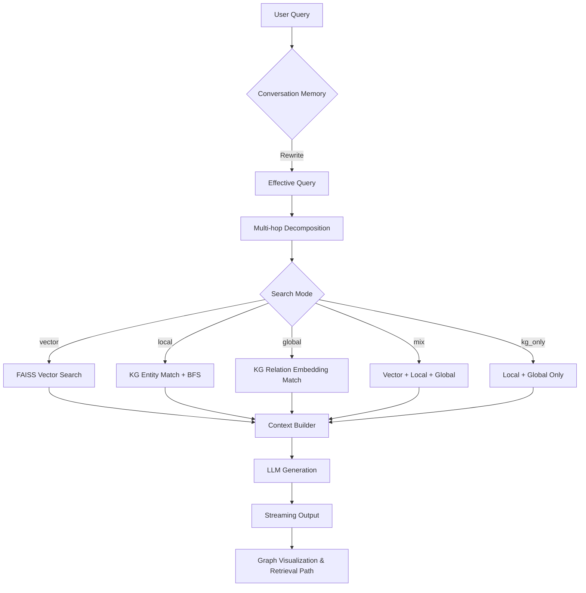

# Architecture

## Pipeline Overview

## Components

| Component | Module | Responsibility |
|-----------|--------|----------------|
| Config | `config.py` | Env-driven settings, model selection, prompts |
| LLM layer | `llm.py` | Unified sync + async (`acall_llm`) provider chain with auto-fallback |
| KG extractor | `kg_extractor.py` | Text → triples (5-stage v2 pipeline) |
| VLM extractor | `vlm_extractor.py` | Images → triples via vision-language models |
| Data importer | `data_importer.py` | TXT/MD/PDF/Word/Image/Web ingestion |
| Data processor | `data_processor.py` | Entity-level chunking + reverse-link relations |
| Index builder | `build_index.py` | FAISS + entity + relation embeddings |
| KG retriever | `kg_reasoning.py` | Dual-layer retrieval + graph algorithms |
| Multi-hop | `multihop.py` | Query decomposition for complex questions |
| Conversation | `conversation.py` | Multi-turn memory + query rewriting |
| RAG engine | `rag_system.py` | Orchestrates the full pipeline |
| Eval harness | `eval_harness.py` | Retrieval + generation metrics, optional RAGAS |
| Web UI | `webapp.py` | Gradio (Q&A / Data Mgmt / Graph viz) |
| REST API | `api_server.py` | FastAPI endpoints + SSE streaming |
| CLI | `cli.py` | Typer subcommands (`init`/`build`/`serve`/`qa`/`extract`) |

## Key Design Decisions

### Entity-level Chunking

Instead of fixed-token chunks, knowledge is grouped by entity. Each chunk holds
all triples that share an entity, so the LLM receives coherent, structured
context rather than arbitrary text windows.

### Embedding-based Entity Matching

Entities are encoded into vectors with BGE and matched via cosine similarity
(FAISS), replacing fragile substring matching. This solves entity-name
inconsistency (e.g. "盗梦空间" vs "Inception").

### Fusion Strategies

Mixed retrieval merges vector + KG results via either:

- **RRF** (Reciprocal Rank Fusion, default): `score(d) = Σ 1/(k + rank_i(d))` — no score normalization needed.
- **Weighted**: simple score-weighted merge.

Set `POCKET_FUSION_STRATEGY=weighted|rrf`.

### PageRank-weighted Ranking

PageRank scores are computed over the KG and used to boost important entities
in both KG-direct and vector results (`PAGERANK_WEIGHT`, default 0.3).

### Local-First & Privacy

Native Ollama support means the entire pipeline — embedding, retrieval,
generation — can run fully offline. No data leaves the machine.

## Evaluation

See [Evaluation Harness](evaluation.md) for the built-in benchmark and metrics.
